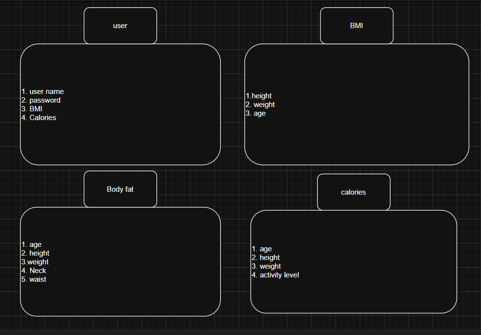

# The-fitness-calculator-project
## 📖 Description
The Super Calculator is a MEN stack fitness app that allows users to calculate and track:
- Body Mass Index (BMI)
- Body Fat Percentage
- Daily Calorie Needs (based on activity level)
## User stories
1. As a user, I want to be able to add a new record, for the one record , should be a graphic counter for the BMI, body fat percentage, and body needs from several macroz
2. AAU, I want to see my records and maybe other users records, only records without the input infos
3. AAU, when I click on the record, I want to see additional outputs like the healthy BMI range, body fat mass, calories needed to loose weight
4. AAU, I want to be able to renewal the records
5. AAU, I should have a navbar to transport between the website pages
6. AAU, I want to be able to delete records easily
## ERD

##  Wire frame
A welcome page, a creating page that displays all the requirments to calculate the BMI, body fat, and macroz, when the you add the record you will be imported to the view of the record there will be all the info's and the sub info's, but in the showing page where all the records is available there will be only the three main info's displayed
## 🛠️ Technologies Used
- **Frontend:** HTML, CSS (Flexbox/Grid), JavaScript, EJS  
- **Backend:** Node.js, Express.js  
- **Database:** MongoDB (Mongoose ODM)  
- **Auth:** Express-session, bcrypt  
## 🙌 Attributions
- [BMI Formula Reference (WHO)](https://www.who.int/news-room/fact-sheets/detail/obesity-and-overweight)  
- [Mifflin-St Jeor Calorie Formula](https://pubmed.ncbi.nlm.nih.gov/2305711/)  
- [Tailwind Color Palette](https://tailwindcss.com/docs/customizing-colors)
## next steps
- To add calculations for the marcos (protein, carbs, fat)
- add social features (leaderboards, share progress)
- add several units (inches,lbs)
     